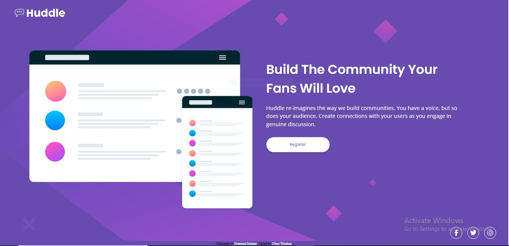

# Frontend Mentor - Huddle landing page with single introductory section solution

This is a solution to the [Huddle landing page with single introductory section challenge on Frontend Mentor](https://www.frontendmentor.io/challenges/huddle-landing-page-with-a-single-introductory-section-B_2Wvxgi0). Frontend Mentor challenges help you improve your coding skills by building realistic projects. 

## Table of contents

- [Overview](#overview)
  - [The challenge](#the-challenge)
  - [Screenshot](#screenshot)
  - [Links](#links)
- [My process](#my-process)
  - [Built with](#built-with)
  - [What I learned](#what-i-learned)
- [Author](#author)

## Overview

### The challenge

Users should be able to:

- View the optimal layout for the page depending on their device's screen size
- See hover states for all interactive elements on the page

### Screenshot




### Links

- Live Site: [Click here](https://lassigcodr.github.io/huddle-landing-page-hero/index.html)

## My process

### Built with

- Semantic HTML5 markup
- CSS custom properties
- Flexbox
- CSS Grid
- Mobile-first workflow

### What I learned

I learnt you could change image colour using filter property, see below:

```css
.icon:hover {
    filter: invert(77%) sepia(57%) saturate(1850%) hue-rotate(300deg) brightness(173%) contrast(95%);
}
```

## Useful resources

- Css tricks

## Author

- Frontend Mentor - [@ctrlwisdom](https://www.frontendmentor.io/profile/ctrlwisdom)
- Twitter - [@ctrlwisdom](https://www.twitter.com/ctrlwisdom)


